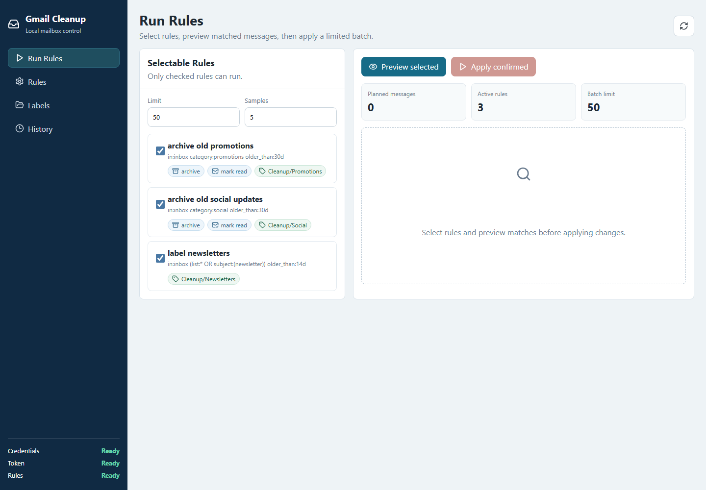
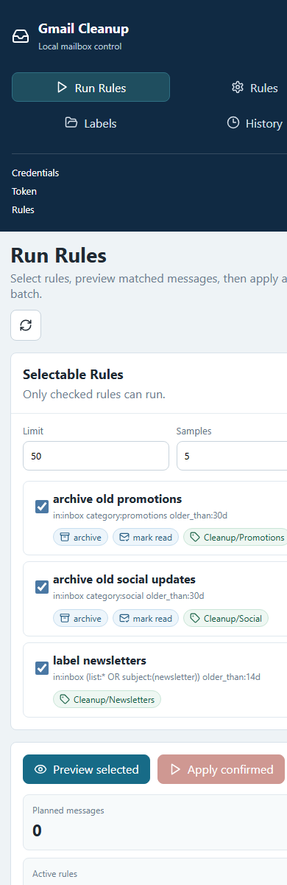
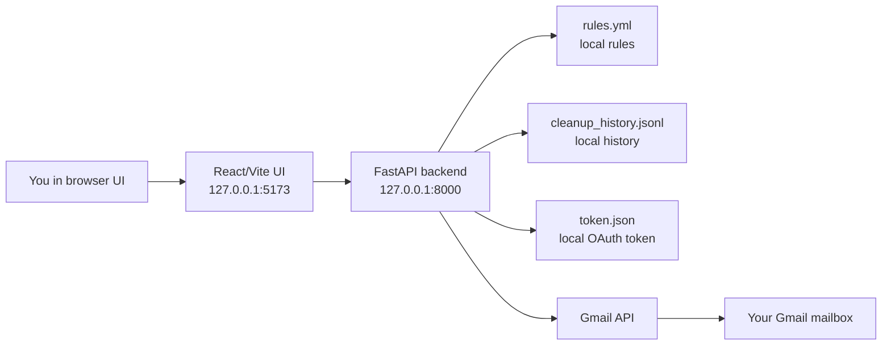

# Gmail Automation

Local Gmail inbox management app for previewing, labeling, archiving, marking
read, and moving messages to Gmail Trash.

The app runs on your computer and uses the Gmail API through your own Google
OAuth desktop client. It includes:

- FastAPI backend for Gmail API operations.
- React + Vite dashboard for rule management and execution.
- CLI fallback for scripted analysis and cleanup.
- Local rule storage in `rules.yml`.
- Local operation history in `cleanup_history.jsonl`.

## Screenshots

Desktop dashboard:



Mobile layout:



## Requirements

Install these before setup:

- Windows, macOS, or Linux with a modern browser.
- Python `3.11` or newer.
- [`uv`](https://docs.astral.sh/uv/) for Python dependency management.
- Node.js `20` or newer and npm.
- A Google Cloud project with Gmail API enabled.
- A Google OAuth desktop client saved locally as `credentials.json`.

Python dependencies are declared in `pyproject.toml`:

- `fastapi`
- `google-api-python-client`
- `google-auth-httplib2`
- `google-auth-oauthlib`
- `PyYAML`
- `truststore`
- `uvicorn[standard]`

Frontend dependencies are declared in `web/package.json`:

- `@vitejs/plugin-react`
- `lucide-react`
- `react`
- `react-dom`
- `typescript`
- `vite`

## Safety Model

The app is designed to preview before changing mail.

- Rule execution requires selecting rules, previewing matches, and confirming.
- Label cleanup moves messages to Gmail Trash, not permanent deletion.
- `archive` removes `INBOX` but keeps messages in All Mail.
- `label` uses an existing Gmail label when it exists, otherwise creates it.
- Label matching is case-insensitive, so `BILL` and `BIll` resolve to the same
  existing Gmail label.
- `credentials.json`, `token.json`, `rules.yml`, and history files are ignored
  by git.

## Architecture Flow



## Google Cloud Setup

You only need to do this once.

### 1. Create or Select a Google Cloud Project

1. Open [Google Cloud Console](https://console.cloud.google.com/).
2. Create a new project, for example `Gmail Automation`, or select an existing
   private project.

### 2. Enable Gmail API

1. In Google Cloud Console, open **APIs & Services > Library**.
2. Search for **Gmail API**.
3. Open Gmail API.
4. Click **Enable**.

### 3. Configure OAuth Consent

1. Open **Google Auth Platform** or **APIs & Services > OAuth consent screen**.
2. Choose **External** for a personal Gmail account.
3. Fill in the app name, for example `Gmail Local Cleanup`.
4. Add your email as the support/contact email.
5. Add these scopes:

   ```text
   https://www.googleapis.com/auth/gmail.modify
   https://www.googleapis.com/auth/gmail.labels
   ```

6. Keep the app in **Testing** mode.

### 4. Add Yourself as a Test User

If you skip this, Google shows:

```text
Access blocked: app has not completed the Google verification process
Error 403: access_denied
```

To fix it:

1. Open **Google Auth Platform > Audience**.
2. Find **Test users**.
3. Click **Add users**.
4. Add the Gmail account you will clean, for example:

   ```text
   user@example.com
   ```

5. Save.

### 5. Create Desktop OAuth Credentials

1. Open **Google Auth Platform > Clients**.
2. Click **Create Client**.
3. Choose **Application type: Desktop app**.
4. Name it `Gmail Cleanup Local`.
5. Click **Create**.
6. Download the JSON file.
7. Rename it to:

   ```text
   credentials.json
   ```

8. Place it in this folder:

   ```text
   C:\path\to\Gmail_Automation\credentials.json
   ```

## Local Setup

From the project root:

```powershell
cd C:\path\to\Gmail_Automation
uv sync --system-certs
```

Install frontend dependencies:

```powershell
cd C:\path\to\Gmail_Automation\web
npm install
```

If npm fails with a certificate error such as
`UNABLE_TO_VERIFY_LEAF_SIGNATURE`, either configure your system/company CA, or
temporarily use:

```powershell
npm config set strict-ssl false
npm install
```

## Start the App

Open two terminals.

Terminal 1, backend:

```powershell
cd C:\path\to\Gmail_Automation
uv run --system-certs uvicorn app_api:app --reload --host 127.0.0.1 --port 8000
```

Terminal 2, frontend:

```powershell
cd C:\path\to\Gmail_Automation\web
npm run dev
```

Open:

```text
http://127.0.0.1:5173
```

On first Gmail access, a Google sign-in window opens. Approve the app. The app
then creates `token.json` locally for future runs.

## UI Guide

### Run Rules

Use this page to execute rules safely.

1. Select one or more rules.
2. Set a small **Limit**, for example `25` or `50`.
3. Click **Preview selected**.
4. Inspect sender, subject, and date samples.
5. Click **Apply confirmed**.
6. Type `APPLY` to confirm.

### Rules

Use this page to create and maintain cleanup rules.

Each rule is a collapsible card. The collapsed view shows:

- Rule name.
- Query summary.
- Attachment status.
- Action badges.
- Duplicate and delete icon buttons.

Open a rule to edit:

- Rule name.
- Gmail search query.
- Attachment-only option.
- Actions.

Recommended company-domain pattern:

```text
(from:company.com OR to:company.com OR cc:company.com)
```

Organization domain example:

```text
(from:example.org OR to:example.org OR cc:example.org)
```

Only emails with attachments:

```text
(from:bank.com OR to:bank.com OR cc:bank.com) has:attachment
```

The UI checkbox adds or removes `has:attachment` for you.

### Labels

Use this page to inspect existing Gmail labels.

- **Load labels** fetches labels from Gmail.
- **Samples** shows example messages under a label.
- **Move to Trash** moves up to the selected limit of messages from that label
  to Gmail Trash after typing `TRASH`.

The active label is highlighted and moved to the top while a label action is in
progress or after samples are loaded.

### History

Shows local history of rule apply and label trash actions.

History is stored in:

```text
cleanup_history.jsonl
```

## Rule Actions

Supported actions:

| Action | Effect |
| --- | --- |
| `label` | Creates or applies a Gmail label. |
| `archive` | Removes `INBOX`; message stays in All Mail and labels. |
| `mark_read` | Removes `UNREAD`. |
| `trash` | Moves message to Gmail Trash. |

## CLI Usage

The GUI is preferred, but the CLI remains available.

Analyze inbox clutter:

```powershell
uv run --system-certs python gmail_cleanup.py analyze --limit 500
```

Preview rule actions:

```powershell
uv run --system-certs python gmail_cleanup.py plan --rules rules.yml --limit 200 --samples 5
```

Apply planned actions:

```powershell
uv run --system-certs python gmail_cleanup.py apply --rules rules.yml --limit 50 --confirm
```

## Project Structure

```text
.
|-- app_api.py           FastAPI backend for local dashboard
|-- gmail_cleanup.py     Gmail API and CLI logic
|-- docs/screenshots/    Public-safe UI screenshots
|-- pyproject.toml       Python dependencies managed by uv
|-- rules.example.yml    Shareable example rules
|-- rules.yml            Your private local rules, gitignored
|-- token.json           Your private OAuth token, gitignored
|-- credentials.json     Your private OAuth client, gitignored
|-- web/                 React + Vite dashboard
`-- README.md
```

## Troubleshooting

### Access blocked: verification process

Add your Gmail account under **Google Auth Platform > Audience > Test users**.
You do not need Google app verification for your private local testing app.

### Missing credentials.json

Download the desktop OAuth client JSON from Google Cloud Console, rename it to
`credentials.json`, and place it in the project root.

### Gmail API certificate errors

Use:

```powershell
uv run --system-certs ...
```

The app also uses `truststore` so runtime Gmail API calls use the Windows system
certificate store.

### npm certificate errors

Prefer configuring the correct CA certificate. If you are on a personal machine
and accept the tradeoff, this can unblock install:

```powershell
npm config set strict-ssl false
npm install
```

### Label already exists or conflicts

The app now matches labels case-insensitively. If Gmail has `BIll` and your rule
uses `BILL`, the existing label is reused.

## Gitignored Private Files

These files should stay local:

```text
credentials.json
token.json
rules.yml
cleanup_history.jsonl
web/node_modules/
web/dist/
```

## Contributing

Issues and pull requests are welcome. Anyone can open an issue or propose a
pull request, but changes are reviewed and merged by the repository owner or
maintainers. See [CONTRIBUTING.md](CONTRIBUTING.md) for details.

## License

This project is licensed under the MIT License. See [LICENSE](LICENSE).
